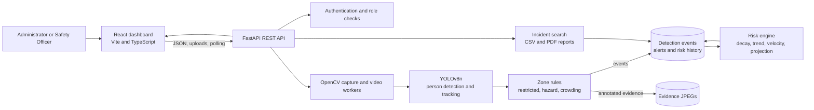

# AI Industrial Safety Copilot

An industrial safety monitoring demo that analyzes camera streams and test videos for people entering restricted areas, approaching hazard zones, or exceeding configured crowd thresholds. It stores detection events and evidence frames, calculates a decaying risk indicator for each zone, and provides incident history and downloadable reports.

The project is intended to demonstrate a practical monitoring workflow—not to replace trained safety personnel, certified safety systems, or validated risk models.

## Working features

- **Person detection and tracking:** Pretrained YOLOv8n detects and tracks people with OpenCV. Analysis runs on CPU and samples every third frame.
- **Camera and video input:** Start a laptop webcam (device 0) or configured RTSP/HTTP(S) stream. Upload an MP4 to test analysis; uploaded video is identified as a test input, not a live camera.
- **Configurable zones:** Create normalized rectangular or polygon zones and set confidence and crowd thresholds. Rectangles can be drawn on a preview frame.
- **Zone events:** Restricted zones produce entry events, hazard/machinery zones produce proximity events, and any zone with a crowd threshold can produce a crowding event. A 30-second cooldown limits repeated events.
- **PPE and fire/smoke detection:** When `models\ppe.pt` and `models\fire_smoke.pt` exist, their detectors run on the same sampled CPU frames as tracking. PPE findings are matched to person head/torso regions; smoke/fire and missing-PPE findings require consecutive detections before an event is recorded. Edit class-ID mappings in `config\model_classes.json`. Model availability is shown on Live Monitoring.
- **Safety Alerts:** Browse and filter alert records by severity, status, zone, camera, and date. Safety Officers and Administrators can acknowledge, investigate, resolve, or mark false positives; assign alerts; and add investigation notes. Status changes, assignments, and notes are recorded in the audit log. The queue polls every five seconds and shows a new-alert badge.
- **Zone Risk:** Calculates a 0–100 score per zone from real stored events, applies exponential time decay, and reports trend, velocity, a five-minute projection, and a plain-English explanation. Cards summarize event categories for the selected period, recommend actions for the most frequent category, and show a repeated-risk badge for three or more events. Choose Last hour, Today, or 7 days to filter the charts and compare the period score with its preceding period.
- **Risk configuration:** The Zone Risk page has a collapsible explanation showing configured event weights, decay half-life, and score-band thresholds.
- **Simulated-history demo:** Authorized users can seed and clear separate simulated risk history. It is labeled `SIMULATED` and does not count as real detections or affect the real risk score.
- **Incident History:** Search and filter stored incidents by date, zone, camera, event type, or text; inspect the event details and evidence frame.
- **Reports:** View backend-generated incident counts by type and zone. Export filtered incidents as CSV or download a day, week, or month PDF report.
- **Authentication and roles:** Register, sign in, and use the Administrator or Safety Officer role. Backend role checks protect privileged operations such as audit-log access and clearing detection data.
- **Timestamp handling:** API timestamps are serialized in UTC; the browser displays them in local time.

## Architecture



The default development database is SQLite. SQLAlchemy and Alembic manage application data and migrations. Evidence images and uploaded MP4 files are stored on the backend host.

## Tech stack

- **Frontend:** React 19, TypeScript, Vite, Tailwind CSS, React Router, Recharts, Lucide icons.
- **Backend:** Python 3.11, FastAPI, Pydantic, SQLAlchemy, Alembic.
- **Vision:** OpenCV, Ultralytics YOLOv8n, CPU inference.
- **Reports:** CSV from Python's standard library; PDF generated with ReportLab.
- **Database:** SQLite by default; SQLAlchemy can be configured to use another supported database.

## Windows setup

Install Python 3.11 and Node.js first. From the repository root, create and prepare the backend environment:

```powershell
py -3.11 -m venv backend\.venv
backend\.venv\Scripts\python.exe -m pip install --upgrade pip
backend\.venv\Scripts\python.exe -m pip install -r backend\requirements.txt
```

Apply the database migrations from the backend directory:

```powershell
Set-Location backend
.\.venv\Scripts\python.exe -m alembic upgrade head
Set-Location ..
```

The default local configuration uses SQLite and a development secret. For anything beyond a local demo, configure a private `SECRET_KEY` and an appropriate `DATABASE_URL` in the backend environment. Do not use the development secret in a deployed environment.

Install frontend dependencies:

```powershell
Set-Location frontend
npm install
Set-Location ..
```

Start the backend and frontend in separate PowerShell terminals:

```powershell
Set-Location backend
.\.venv\Scripts\python.exe -m uvicorn app.main:app --reload --host 127.0.0.1 --port 8000
```

```powershell
Set-Location frontend
npm run dev
```

Open the Vite URL shown in the frontend terminal (normally `http://localhost:5173`). The Vite development server proxies `/api` requests to the backend on port 8000. The webcam and video processing run on the machine hosting the backend.

The pretrained COCO person model is loaded from `models\yolov8n.pt` when that file exists; otherwise Ultralytics is asked to resolve `yolov8n.pt` and may download it. PPE and fire/smoke models are optional; place `ppe.pt` and `fire_smoke.pt` in `models` to enable them.

To run the backend tests:

```powershell
Set-Location backend
.\.venv\Scripts\python.exe -m pytest -q
```

## Run the demo

1. Start the backend and frontend, then register and sign in.
2. In **Camera Management**, create a camera. Add a stream URL if testing RTSP/HTTP; the webcam option uses device 0 on the backend machine.
3. In **Zones & Thresholds**, configure at least one zone. For the event types, use a Restricted zone for entry events and a Hazard/Machinery zone for proximity events. Set a crowd threshold on any zone where crowding should be detected.
4. In **Zone Risk & Thresholds**, use **Clear detection events and risk history** to start with no real stored event, alert, evidence, or risk-history data. This does not remove cameras, zones, users, or simulated history.
5. Open **Live Monitoring** and select **Test MP4** on the camera card. The UI shows upload and analysis progress and identifies the source as an uploaded test video.
6. Watch for annotated frames and any generated events. The real zone risk score changes only when the video produces matching detections for configured zones; if there are no qualifying detections, there may be no score increase. Risk cards refresh periodically.
7. To preview the chart and warning UI without generating detections, choose **Seed simulated history** on the Zone Risk page. It adds visibly labeled `SIMULATED` history; the actual risk score remains based on real events. Choose **Clear simulated history** to remove those demo samples.
8. Use **Incident History** to inspect incidents and export the filtered table as CSV. Use **Reports** to download a PDF for a day, week, or month.

The simulated seed assigns its example profiles by zone creation order: increasing/high, rapid escalation, then stable/green. Create at least three zones to see all three scenarios. Simulated examples are historical chart/demo values; they do not represent actual observations.

## Risk score and settings

For each stored event \(i\), the engine contributes its configured event weight reduced by exponential half-life decay:

\[
R = \operatorname{round}\left(\sum_i w_i \cdot e^{-\ln(2)\,a_i / H}\right)
\]

The final score is clamped to the range 0–100. Here, \(w_i\) is the event-type weight, \(a_i\) is the event age in minutes, and \(H\) is the decay half-life in minutes. With the default \(H=30\), an event's contribution halves every 30 minutes. Repeated records are subject to event deduplication before they enter this calculation.

Trend and velocity come from a linear-regression slope over recent stored risk-history samples (the current trend window is 15 minutes). The trend is increasing above 0.5 points per minute, decreasing below -0.5, and otherwise stable. The five-minute projection applies that slope to the current score and clamps the result to 0–100. Rapid escalation uses a configurable velocity threshold. These outputs are calculated indicators, not validated predictions.

Configure these backend environment variables (prefix settings with `RISK_`):

| Variable | Default | Meaning |
| --- | ---: | --- |
| `RISK_WEIGHT_RESTRICTED_ENTRY` | `15` | Contribution for a restricted-zone entry |
| `RISK_WEIGHT_HAZARD_PROXIMITY` | `12` | Contribution for hazard-zone proximity |
| `RISK_WEIGHT_CROWDING` | `8` | Contribution for a crowding event |
| `RISK_WEIGHT_MISSING_HELMET` | `10` | Contribution for a missing-hardhat event |
| `RISK_WEIGHT_MISSING_VEST` | `10` | Contribution for a missing-safety-vest event |
| `RISK_WEIGHT_SMOKE` | `35` | Contribution for a smoke detection |
| `RISK_WEIGHT_FIRE` | `60` | Contribution for a fire detection |
| `RISK_DECAY_HALF_LIFE_MINUTES` | `30` | Exponential decay half-life; must be greater than zero |
| `RISK_RAPID_ESCALATION_VELOCITY` | `8` | Points per minute at or above which rapid escalation is shown |
| `RISK_BAND_LOW_MAX` | `33` | Maximum score in the green/low band |
| `RISK_BAND_GUARDED_MAX` | `55` | Maximum score in the yellow/guarded band |
| `RISK_BAND_ELEVATED_MAX` | `75` | Maximum score in the orange/elevated band |

Vision confirmation and fire/smoke confidence can be tuned with `VISION_CONFIRMATION_FRAMES` (default `3`) and `FIRE_SMOKE_CONFIDENCE_THRESHOLD` (default `0.5`, range 0–1). The supplemental models run only on the person tracker’s sampled frames.

## Limitations

- **PPE and fire/smoke model quality depends on supplied weights.** The application supports `models\ppe.pt` and `models\fire_smoke.pt`; it does not train, certify, or validate them. PPE findings are ignored unless their boxes overlap the tracked person's head/torso, and missing-hardhat detections are ignored when no hardhat is found anywhere in that frame. Consecutive-frame confirmation and cooldowns reduce repeated alerts but do not eliminate false positives or false negatives.
- **CPU analysis is slow.** All three models run on CPU and inference is sampled every third frame; processing may fall behind on long or high-resolution videos. No GPU acceleration is configured by this application.
- **Fire/smoke confidence defaults to `0.5` and confirmation defaults to three sampled frames.** Adjust `FIRE_SMOKE_CONFIDENCE_THRESHOLD` and `VISION_CONFIRMATION_FRAMES` for the environment; tuning does not substitute for model validation.
- **Risk scores and warnings are calculated indicators, not validated predictions.** They are not a certified safety assessment and must not be used as the sole basis for operational decisions.
- **Simulated history is not real.** Seeded records are visibly labeled `SIMULATED`, stored separately from detections, and excluded from the calculated real risk score.
- **The alert workflow is intentionally trimmed.** Status changes, assignment, investigation notes, and audit logging are implemented, but escalation rules and external notifications are not.
- **Tracking is not persistent identity.** Person track IDs can change, disappear, or be reused; they are only short-lived tracking labels.
- **This is a local demonstration application.** It does not include production hardening, high availability, managed storage, or a validated deployment/security configuration.

## Privacy

The vision pipeline performs person detection and tracking only; it does **not** perform facial recognition or attempt to identify people by name. `Person <ID>` labels are anonymous tracker IDs and may change between analyses. Annotated evidence images and uploaded test videos are stored on the backend machine in `backend\evidence` and `backend\uploads`; protect and remove those files according to your organization's data-retention requirements.

## Safety disclaimer

This software is a prototype for demonstration and evaluation. It can miss hazards, produce false detections, or calculate misleading risk values. Do not rely on it as a substitute for qualified safety personnel, established procedures, certified protective equipment, or regulated safety systems. Verify alerts and outputs with a human reviewer before taking action.

## Future improvements

- Validate PPE and fire/smoke models and thresholds against representative site data.
- Add alert escalation rules and external notifications.
- Improve performance with configurable sampling, optimized inference, and optional GPU support.
- Add deployment hardening, retention controls, and operational monitoring.
- Validate risk weights, decay, warning thresholds, and projections against representative incident data with domain experts.
